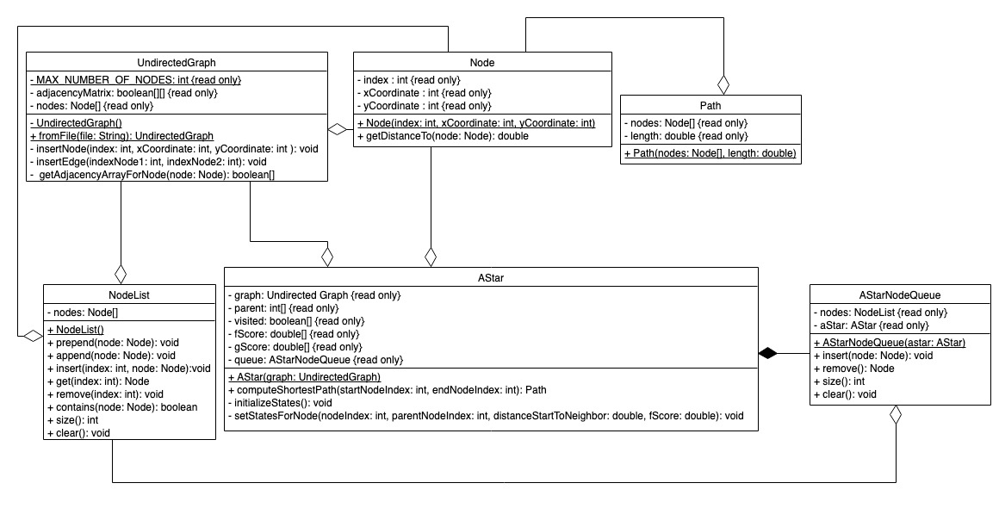

# IKT Projekt - A* Algorithmus

von [Anne Gliesche](https://github.com/spielogabi), [Anna-Frieda Gruse](https://github.com/cosmoem), [Sophie Schröder](https://github.com/sophieschrder), [Yasmin Yelken](https://github.com/yyasemin), [Laura Zaworski](https://github.com/LauraZaworski)

Dieses Projekt ist im Rahmen der Lehrveranstaltung "IKT" an der HTW Berlin im SS 20 entstanden.

## 1. Aufgabenstellung

In einem Land „Quadratien“ existieren auf einer Fläche von 100.000 x 100.000 km genau 10.000 Ortschaften. 
Diese Orte sind mit Straßen verbunden, welche in beide Richtungen befahren werden können. 
Die Orte und Straßen lassen sich deshalb als ungerichteter Graph modellieren.
Wir sollten nun mit Hilfe des A*-Algorithmus den kürzesten Weg zwischen zwei Ortschaften berechnen. 
Unser Programm sollte dabei drei Argumente akzeptieren:

	 1. Eingabedatei mit dem Verzeichnis der Ortschaften und Straßen
	 2. Index der Start-Ortschaft
	 3. Index der Ziel-Ortschaft
	
Als Ergebnis sollte unsere Anwendung die Länge des kürzesten Weges und den Weg selbst ausgeben. 
Außerdem muss das Ergebnis des Profilers angezeigt werden.

## 2. Allgemeiner Aufbau

In unserer Implementierung ist der Graph vom Algorithmus getrennt, d.h. dass ein Graph auch ohne den Algorithmus existieren kann, nicht aber umgekehrt. 

Die **UndirectedGraph** Klasse modelliert den Graphen. Sie enthält Knoten (**Node**), welche jeweils für die Ortschaften stehen. 
Jeder Knoten hat einen einzigartigen Index, der dafür sorgt, dass man ihn eindeutig identifizieren kann und es somit keine doppelten Knoten gibt.
Außerdem hat jeder Knoten x- und y-Wert, welche bestimmen, wo sich der Knoten befindet. Diese Knoten sind verbunden durch Kanten, welche die Straßen zwischen 
den Knoten bzw. Ortschaften bilden. Sie werden als Adjazenzmatrix dargestellt.

Bei der **NodeList** handelt es sich um eine eigene Implementierung einer nicht-generischen ArrayList, da diese ein Array an Knoten enthält. Diese Datenstruktur 
haben wir gewählt, da damit schnelle Zugriffe möglich sind und die Länge flexibel ist. 

Bei der Erzeugung eines **AStar**-Objekts wird diesem ein UndirectedGraph übergeben. Für diesen kann dann mit der `computeShortestPath`-Methode der kürzeste Weg 
zwischen zwei Orten berechnet und als Path-Objekt zurückgegeben werden. Auf dem gleichen AStar-Objekt können mehrere verschiedene Wege berechnet werden, ohne 
dass das Objekt neu erzeugt werden muss. 

AStar beinhaltet außerdem ein **AStarNodeQueue**-Objekt. In diese Warteschlange werden während der Abarbeitung des Algorithmus Knoten nach ihrem f-Score 
sortiert eingefügt. Der Grund für die Wahl dieser Datenstruktur hier war, dass wir immer nur auf den ersten Knoten zugreifen müssen und Knoten sortiert einfügen 
wollen. Die NodeList, die dem Ganzen zugrunde liegt, ermöglicht außerdem die flexible Länge.

In der Dataclass **Path** werden die Knoten eines gefundenen Weges in der richtigen Reihenfolge und zusammen mit der Länge des Weges eingespeichert.

## 3. Heuristik

Das Ziel des A*-Algorithmus ist es, den kürzesten Weg zwischen zwei Orten zu finden. Bei der Suche werden nacheinander die Knoten
betrachtet, die den kleinsten f-Score haben, also am vielversprechendsten sind und potenziell am schnellsten zum Ziel führen. Würde man in einem großen 
Graphen immer all möglichen Wege berechnen, dann würde das Suchen viel zu lange dauern und wäre am Ende viel zu langsam. Aus diesem Grund wird eine Heuristik 
verwendet. Der f-Score, welcher die Reihenfolge der Abarbeitung festlegt, besteht aus der Summe des g-Scores, dem tatsächlichen Weg zum betrachteten Knoten, und
des h-Scores, der geschätzten Distanz zwischen diesem Knoten und dem Ziel. Dieses Schätzen ist die Heuristik und spart viel Zeit, da so nicht alle möglichen 
Wege von einem Knoten bis zum Ziel berechnet werden müssen. 

Der Algorithmus legt an sich nicht fest, welche Heuristik/ Schätzfunktion zu verwenden ist. Im Prinzip kann man diese frei wählen, allerdings muss man darauf 
achten, dass die Schätzfunktion auch zulässig ist. Das bedeutet, dass die Schätzfunktion niemals die Distanz für eine Strecke überschätzen darf. Wir haben uns 
als Heuristik für die Luftlinie/ Euklidische entschieden, da die Luftlinie immer der kürzeste Weg zwischen zwei Knoten ist. 

Falls man bei der Implementierung mit einer sogenannten Closed List arbeitet, was wir tun, muss die Heuristik außerdem monoton bzw. konsistent sein. Das 
bedeutet, dass der geschätzte Weg von einem Knoten K zum Zielknoten niemals größer sein darf, als der tatsächliche Weg von K zu einem Nachfolgerknoten L plus
die geschätzte Distanz von L bis zum Zielknoten (Dreiecksungleichung). Die Euklidische Distanz erfüllt diese Bedingung ebenfalls. Im Spezialfall, dass der 
Knoten L genau auf der Luftlinienstrecke zwischen K und Zielknoten liegt, ist die Summe vom g-Score von L und dem h-Score von L immer noch maximal gleich, 
aber niemals größer.

Wichtig zu beachten ist, dass bei uns die Schätzfunktion der Distanzfunktion entspricht, da die Straßen/ Kanten zwischen den Orten in unserem Beispiel 
immer gerade sind, also eben auch Luftlinie. Der gleiche Code wird also für beide Usecases verwendet.

## 4. Laufzeitmessung

### 4.1 Am Beispiel

Berechnung des Wegen von 0 nach 1 für einen Beispielgraph.

**Referenzimplementierung**

**Unser Code**

In der Referenzimplementierung findet das Einlesen des Graphen aus der Datei in der Main statt und zählt somit zur Object construction time. Diese muss zur 
Execution time dazu addiert werden. In unserem Code hingegen findet keinerlei Objekterzeugung in der Main statt, weshalb die Verteilung der Zeiten so 
unterschiedlich ist. Trotzdem müssen auch hier Object construction time und Execution time addiert werden. Im Vergleich sieht man deutlich, dass unsere 
Implementierung fast doppelt so schnell ist (1.249ms vs. 695ms). Außerdem verbraucht sie nur etwa 1/8 an Speicherplatz.

### 4.2 Im Durchschnitt

**Referenzimplementierung**

**Unser Code**

Wir haben beide Implementierungen fünfmal für den Weg von 0 bis 1 auf dem gleichen Beispielgraphen laufen lassen, die Werte erfasst und den Durchschnitt 
berechnet. Auch hier sieht man, dass unsere Implementierung im Durchschnitt deutlich schneller ist als die Referenzimplementierung und nur einen 
Bruchteil des Speicherplatzes verbraucht.
