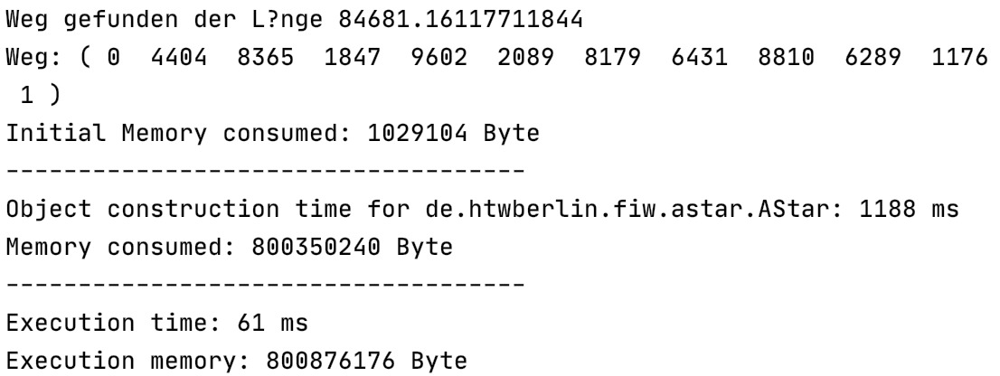

# IKT Projekt - A* Algorithmus

von [Anne Gliesche](https://github.com/spielogabi), [Anna-Frieda Gruse](https://github.com/cosmoem), [Sophie Schröder](https://github.com/sophieschrder), [Yasmin Yelken](https://github.com/yyasemin), [Laura Zaworski](https://github.com/LauraZaworski)

Dieses Projekt ist im Rahmen der Lehrveranstaltung "IKT" an der HTW Berlin im SS 20 entstanden.

## 1. Aufgabenstellung

In einem Land „Quadratien“ existieren auf einer Fläche von 100.000 x 100.000km genau 10.000 Ortschaften.
Wir sollen mit Hilfe des A*-Algorithmus den kürzesten Weg zwischen zwei Ortschaften berechnen. Dabei ist zu beachten, dass es ein ungerichteter Graph sein muss. 
Unser Programm soll dabei 3 Argumente akzeptieren:

	 1. Die Eingabedatei mit dem Verzeichnis der Ortschaften
	 2. Der Index der Start-Ortschaft
	 3. Der Index der Ziel-Ortschaft
	
Als Ergebnis soll unsere Anwendung die Länge des kürzesten Weges und den Weg selbst ausgeben, außerdem das Ergebnis des Profilers anzeigen.

## 2. Allgemeiner Aufbau

In unserer Implementierung sind Graph und Algorithmus voneinander getrennt. Die unterrichtete Graph Klasse enthält Knoten (Node), welche jeweils für die Ortschaften stehen. Jeder Knoten hat einen einzigartigen Identifier, der dafür sorgt, dass es keine doppelten Knoten gibt, und einen x und y Wert welche bestimmen, wo sich der Knoten befindet. 
Diese Knoten sind verbunden durch Kanten, welche die Straßen zwischen den Knoten bzw. Ortschaften bilden, sie werden als Adjazenzmatrix dargestellt.

## 3. Heuristik

Wir wollen mit dem Algorithmus den kürzesten Weg finden, das heisst wir versuchen immer zu betrachten, welche Knoten am viel versprechendsten sind, also uns am schnellsten zum Ziel bringen. Würden wir in einem großen Graphen immer die richtigen Werte nehmen, dann würde das Suchen viel zu lange dauern und wäre am Ende viel zu langsam. Aus diesem Grund schätzen wir. Der Algorithmus legt jedoch nicht fest, welche Schätzfunktion zu verwenden ist. Im Prinzip kann man diese frei wählen, allerdings muss man darauf achten, dass die Schätzfunktion auch zulässig ist. 
Dies bedeutet, dass die Schätzfunktion niemals die Distanz für eine Strecke überschätzen darf.
Wir haben uns als Heuristik für die Luftlinie entschieden, da die Luftlinie immer der kürzeste Weg zwischen zwei Knoten ist. Hier ist zu beachten, dass unsere Schätzfunktion das gleiche ist, wie unsere Distanzfunktion, da die Straßen/Kanten zwischen den Orten in unserem Beispiel immer gerade sind, also quasi Luftlinie. 
Daraus ergibt sich der h-score (Heuristisch berechnete/geschätzte Distanz), welcher in unserem Fall der geschätzte Weg von einem Knoten zum Zielknoten ist. Berechnet wird er mit euklidischen Distanz (geschätzte Luftlinie und Satz des Pythagoras).

## 4. Laufzeitmessung

### 4.1 Am Beispiel

**Referenzimplementierung**

**Unser Code**

In der Referenzimplementierung findet das Einlesen des Graphen aus der Datei in der Main statt und zählt somit zur object construction time, diese muss zur execution time dazu addiert werden. In unserem Code hingegen findet keinerlei Objekterzeugung in der Main statt, weshalb die Verteilung der Zeiten so unterschiedlich ist. Trotzdem müssen auch hier object construction time und execution time addiert werden.
Im Vergleich sieht man deutlich, dass unsere Implementierung fast doppelt so schnell ist (1.249ms vs. 695ms), außerdem verbraucht sie nur etwa 1/8 an Speicherplatz.

### 4.2 Im Durchschnitt

**Referenzimplementierung**

**Unser Code**

Wir haben Implementierungen 5x für den gleichen Weg von 0 bis 1 laufen lassen, die Werte erfasst und den Durchschnitt berechnet. Auch hier sieht man, dass unsere Implementierung im Durchschnitt deutlich schneller ist als die Referenzimplementierung und nur einen Bruchteil des Speicherplatzes verbraucht.
